# QuickClip

<div align="center">
  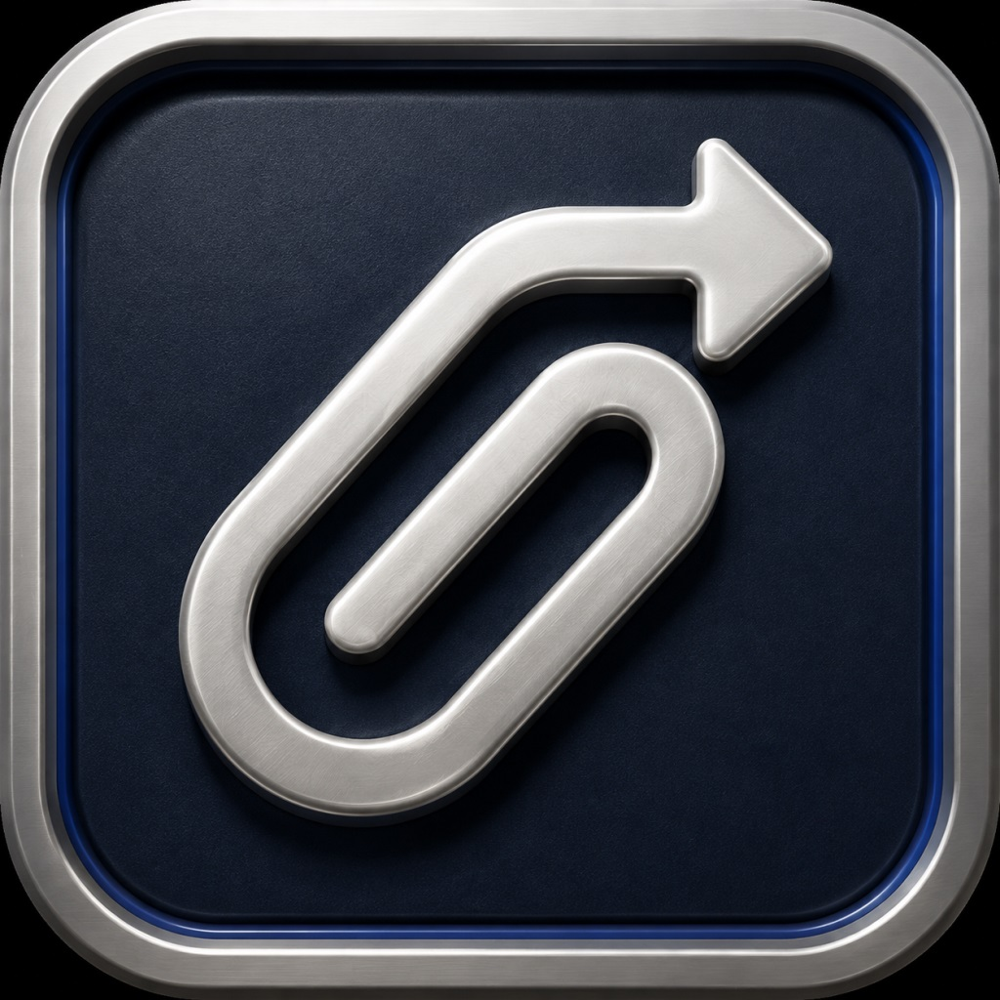

  **Private, local-network clipboard and file sharing between Windows and iPhone.**

  [](https://opensource.org/licenses/MIT)
  
  
</div>

QuickClip runs an HTTPS and WebSocket server inside an Electron app on your Windows PC. An iPhone on the same local network connects through the QuickClip web app, allowing text, images, and files to move in either direction without a cloud relay.

> [!IMPORTANT]
> Transfers stay on the local network, but every device on that network should still be treated as untrusted. Keep the pairing link and token private, and only install the QuickClip certificate you generated on your own PC.

## What it does

- Synchronizes copied text and clipboard images between Windows and iPhone.
- Transfers photos, videos, documents, and archives up to 500 MB over local Wi-Fi.
- Keeps a session-only clipboard history and a persistent shared-file list.
- Encrypts traffic in transit with a locally generated CA and server certificate.
- Authenticates the phone with a random pairing token embedded in the QR link fragment.
- Runs in the Windows system tray and lets you pause text, image, or file synchronization.
- Supports light and dark interfaces on both devices.

## Demo

### Pair from Windows

<p align="center">
  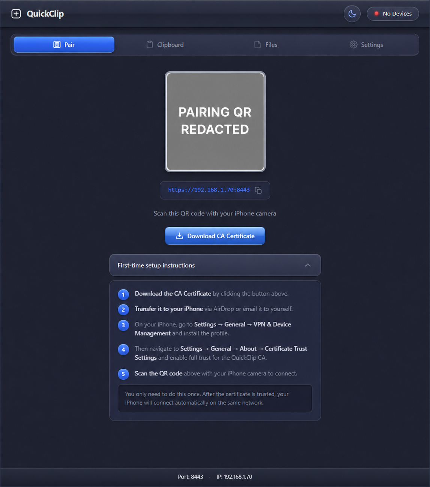
</p>
<p align="center"><sub>The Windows Pair tab shows the local server address, QR code, certificate download, and the one-time iPhone trust steps.</sub></p>

Scan the QR code after installing and trusting the certificate. The phone stores the PC address and pairing token locally, then removes the credentials from the visible URL.

### Clipboard in both directions

<table>
  <tr>
    <td width="50%">
      <video src="./assets/readme/windows-to-iphone-clipboard.mp4" controls playsinline width="100%"></video>
      <p><sub>Windows to iPhone: copying the selected Notepad text adds it to QuickClip's clipboard history so it is available on the connected phone.</sub></p>
      <p><a href="./assets/readme/windows-to-iphone-clipboard.mp4">Open the Windows-to-iPhone recording</a></p>
    </td>
    <td width="50%">
      <video src="./assets/readme/iphone-to-windows-clipboard.mov" controls playsinline width="100%"></video>
      <p><sub>iPhone to Windows: QuickClip reads the clipboard after the user approves the paste action, sends it to Windows, and waits for delivery confirmation.</sub></p>
      <p><a href="./assets/readme/iphone-to-windows-clipboard.mov">Open the iPhone-to-Windows recording</a></p>
    </td>
  </tr>
</table>

> [!NOTE]
> GitHub may show the recordings as links instead of inline players. The linked files are the same demos stored in this repository.

<p align="center">
  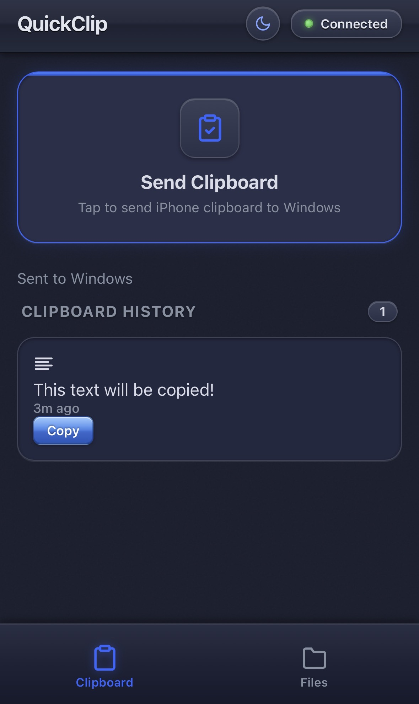
</p>
<p align="center"><sub>The connected iPhone view provides an explicit Send Clipboard action and a Copy button for items received from Windows.</sub></p>

<p align="center">
  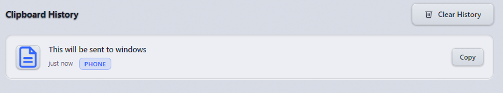
</p>
<p align="center"><sub>On Windows, received text is recorded in the current session's clipboard history and marked with its source device.</sub></p>

Browser clipboard access requires a user action on iOS, so the phone cannot silently monitor or replace the system clipboard in the background. Tap **Send Clipboard** or **Copy** when moving content through the phone.

### Transfer files

<p align="center">
  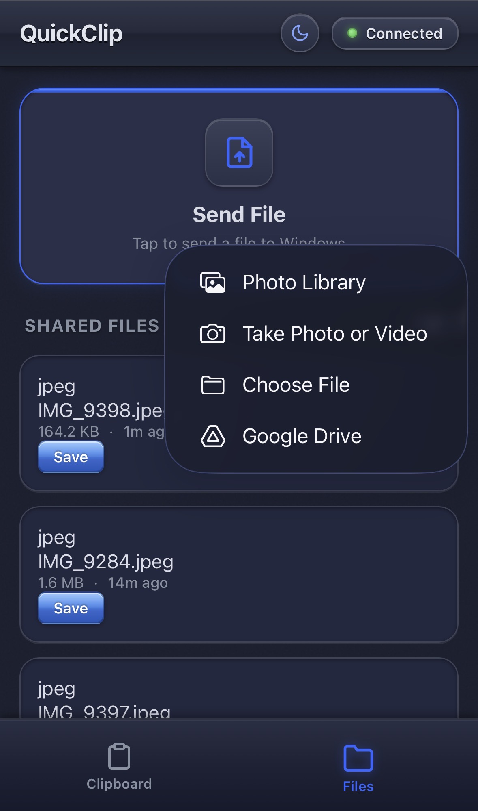
</p>
<p align="center"><sub>The iPhone Files tab can choose an item from Photos, the camera, Files, or another provider and send it directly to the Windows PC.</sub></p>

Files uploaded from the phone are stored under QuickClip's per-user `runtime/received` directory. Files selected on Windows are copied into the same managed directory and announced to connected phones, where **Save** requests a short-lived download link.

### Configure synchronization

<p align="center">
  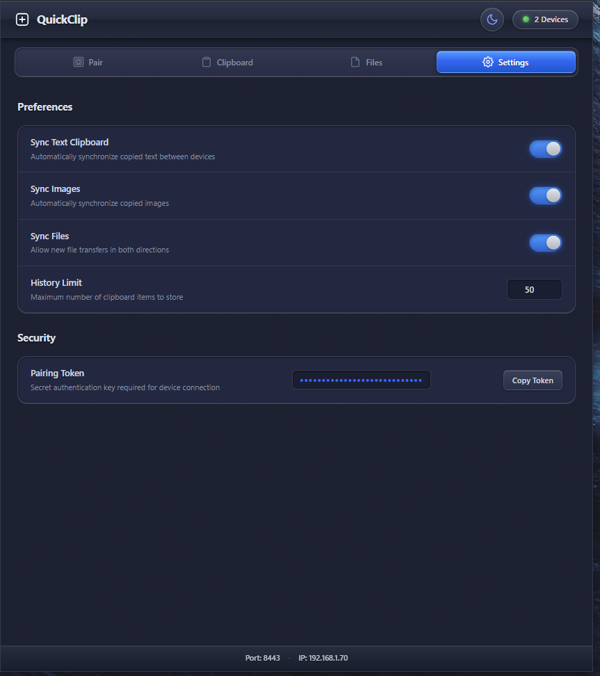
</p>
<p align="center"><sub>The Windows Settings tab controls which transfer types are accepted, the clipboard-history limit, and access to the pairing token.</sub></p>

<details>
<summary><strong>Light and dark pairing views</strong></summary>

<table>
  <tr>
    <td width="50%">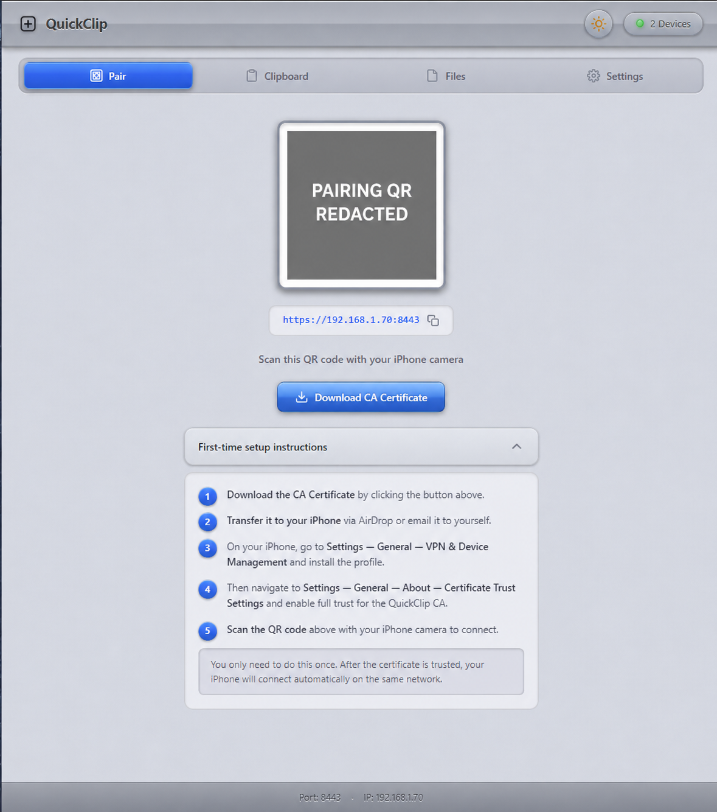</td>
    <td width="50%"></td>
  </tr>
  <tr>
    <td><sub>Light mode keeps the pairing controls and setup checklist visible against a bright desktop theme.</sub></td>
    <td><sub>Dark mode presents the same QR code, server address, and certificate workflow.</sub></td>
  </tr>
</table>

</details>

## Architecture & How It Works

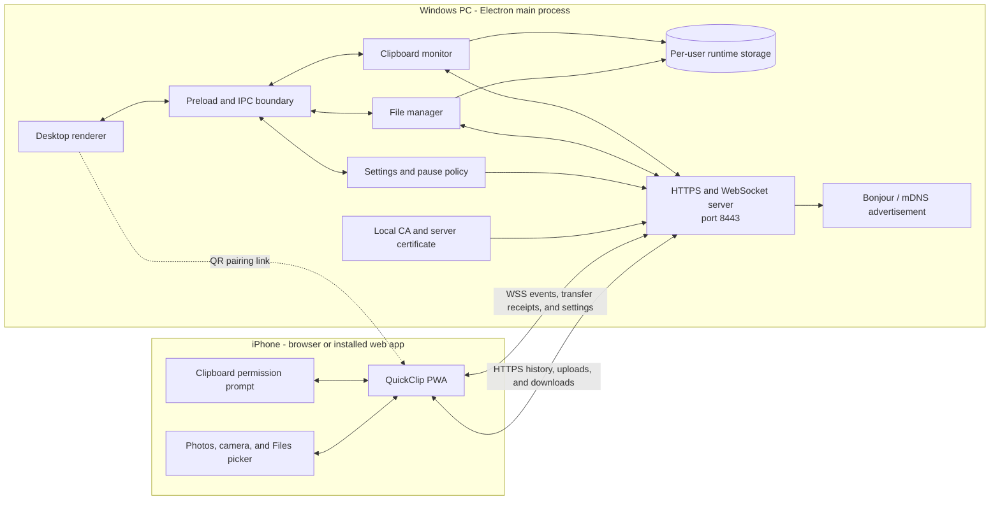

1. **Startup:** Electron migrates legacy data when needed, loads the pairing token and settings, chooses a local IPv4 address, creates or reuses TLS certificates, and starts Express and WebSocket on port `8443`. The service is also advertised over Bonjour/mDNS.
2. **Pairing:** The desktop QR code contains the HTTPS address plus `ip`, `port`, and `token` values in the URL fragment. The phone saves these locally and removes the fragment from the address bar. The token is then used for authenticated API calls and the WebSocket handshake.
3. **Windows to iPhone clipboard:** The Windows clipboard monitor polls for changes, records accepted text or images in session history, and broadcasts a WebSocket event. Disabled image sync skips image reads. Eligible images are checked using pixel fingerprints, with PNG encoding only when pixels or dimensions change; oversized dimensions are rejected first. Text travels in the event; image history sends metadata and a thumbnail, while full-resolution image data is fetched only when the phone copies it.
4. **iPhone to Windows clipboard:** A tap on **Send Clipboard** lets the browser read text or an image. The PWA sends a transfer ID and payload over WebSocket. Windows validates the active settings and size limits, writes the system clipboard, records the item, and returns a receipt. Unconfirmed clipboard transfers can be retried for five minutes without intentionally duplicating a receipt already accepted in the current Windows session.
5. **Files:** Phone uploads use authenticated HTTPS and stream into managed temporary storage before being moved into `runtime/received`. Files chosen on Windows are copied into that directory. Connected devices receive a WebSocket availability event; downloads use file-scoped tickets that expire after 60 seconds.
6. **Settings and pause:** Desktop settings update the shared policy and are broadcast to connected phones. Disabling a content type or pausing sync blocks new transfers without deleting existing history or files.

QuickClip uses TLS between the phone and PC and does not require a cloud service. It is not an internet-facing service and should remain behind a trusted local network and firewall.

## Requirements

- Windows 10 or Windows 11, 64-bit
- Node.js 18 or newer
- Git, if cloning instead of downloading the repository as an archive
- A Windows PC and iPhone on the same Wi-Fi network
- A network that allows devices to communicate with each other; guest networks and AP/client isolation usually block QuickClip

## Install and run

```powershell
git clone https://github.com/shimshiam/QuickClip.git
cd QuickClip
npm install
npm start
```

For development, use `npm run dev`. This opens Electron's developer tools with the desktop app.

On first launch QuickClip:

1. Creates `%APPDATA%/quickclip/runtime` and a random pairing token.
2. Generates a local CA and an IP-specific server certificate under `runtime/certs`.
3. Starts the HTTPS and WebSocket server on port `8443`.
4. Starts clipboard monitoring and advertises the local HTTPS service with Bonjour/mDNS.
5. Opens the desktop dashboard and displays the pairing QR code.

## One-time iPhone setup

### 1. Move the CA certificate to the iPhone

On the Windows **Pair** tab, select **Download CA Certificate**. Transfer `QuickClip-CA.crt` to your iPhone, then open it from the Files app.

<p align="center">
  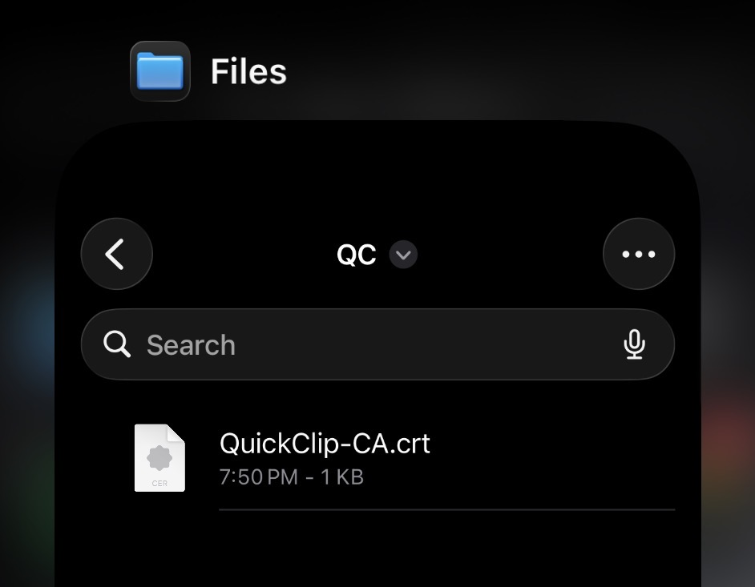
</p>
<p align="center"><sub>The QuickClip CA file is ready to be opened on the iPhone so iOS can download its configuration profile.</sub></p>

### 2. Install the configuration profile

Open **Settings > General > VPN & Device Management**, select **QuickClip**, and install the profile.

<p align="center">
  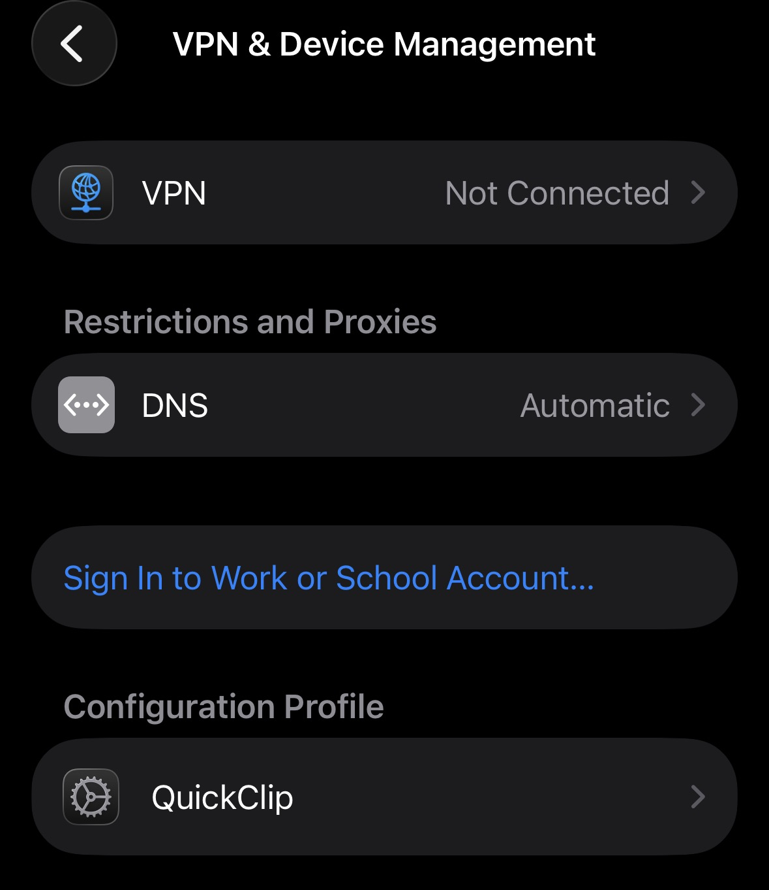
</p>
<p align="center"><sub>After the certificate file is opened, the QuickClip entry appears under Configuration Profile in VPN & Device Management.</sub></p>

### 3. Enable full trust

Open **Settings > General > About > Certificate Trust Settings**. Under **Enable Full Trust for Root Certificates**, turn on **QuickClip** and confirm.

<p align="center">
  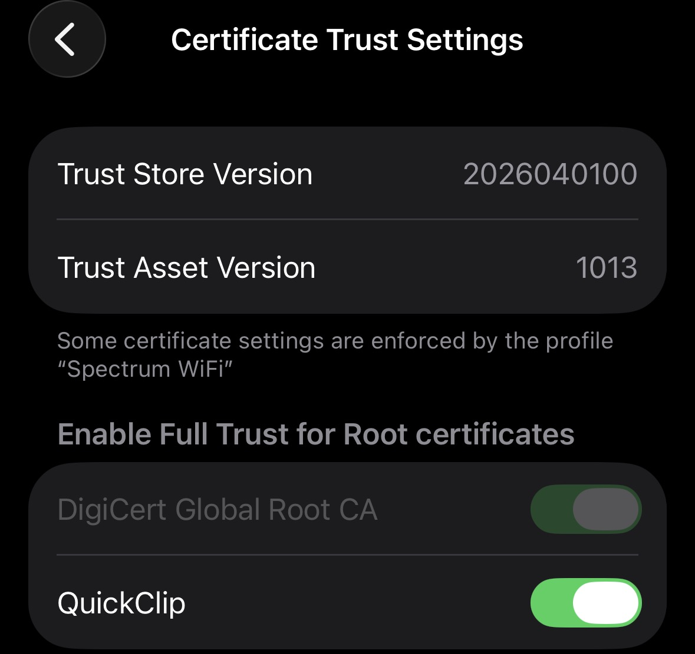
</p>
<p align="center"><sub>Full trust allows iOS to validate QuickClip's local HTTPS page and secure WebSocket connection.</sub></p>

### 4. Scan and connect

Return to the Windows **Pair** tab and scan its QR code with the iPhone camera. Open the link and wait for **Connected**. In Safari, use **Share > Add to Home Screen** if you want QuickClip to launch like an app.

> [!TIP]
> If **Connecting...** persistently remains on screen in Safari after the certificate is installed and trusted, open the pairing link in **Chrome on the iPhone** instead.

<details>
<summary><strong>Why Windows may call the CA certificate untrusted</strong></summary>

<p align="center">
  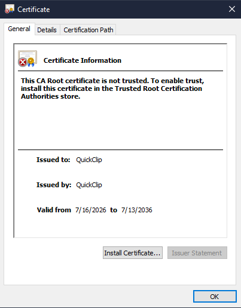
</p>
<p align="center"><sub>Double-clicking the downloaded CA on Windows can show this message because the CA is not installed in the Windows Trusted Root store. QuickClip's iPhone setup only requires transferring this file and trusting it on iOS; this Windows dialog is not the iPhone trust step.</sub></p>

</details>

## Configuration and storage

QuickClip stores runtime data in `app.getPath('userData')/runtime`, normally `%APPDATA%/quickclip/runtime` on Windows.

| Path | Purpose |
| --- | --- |
| `runtime/config.json` | Pairing token and validated synchronization settings |
| `runtime/certs/` | Local CA, server certificate, private keys, and the last certificate IP |
| `runtime/received/` | Files transferred in either direction |
| `runtime/received/index.json` | Metadata and managed local paths for shared files |
| `runtime/clipboard-images/` | Full-resolution images for the current clipboard-history session |
| `runtime/tmp/` | Temporary storage used while phone uploads are in progress |

When migrating from the older project-level `data/` directory, QuickClip copies and verifies the data before activating the new location. The original directory is retained as a recovery copy. Clipboard history is session-only; associated image files are removed as entries expire, history is cleared, or the app exits. Received files persist.

At startup, QuickClip renews the server certificate if it expires within 30 days, has already expired, or the selected IP has changed. It keeps the existing CA certificate and key, so routine renewal does not require reinstalling the iPhone profile. Renewal checks run at startup; they do not restore trust if iOS has disabled the installed profile.

### Limits and delivery behavior

- Text clipboard payload: up to 1 MiB of UTF-8 data.
- Clipboard image: PNG or JPEG, up to 20 MiB compressed and after PNG conversion, and up to 40 megapixels.
- File upload: one file at a time, up to 500 MiB.
- Clipboard history: 1 to 200 items, with 50 as the default.
- Clipboard delivery confirmation: 15-second confirmation window and a five-minute retry window.
- Download tickets: scoped to one file or image and valid for 60 seconds.

The text and image limits can be lowered with `maxTextBytes` and `maxImageBytes` in `runtime/config.json` while QuickClip is closed. Large images can be sent as ordinary files. If a phone upload is interrupted by backgrounding or the ten-minute upload timeout, check Windows before retrying because file uploads do not use clipboard-style receipt deduplication.

### Network interface selection

QuickClip prefers private LAN addresses on likely Ethernet or Wi-Fi adapters over known virtual adapters, VPNs, shared VPN address ranges, and link-local addresses. This is a heuristic; adapter names cannot prove which network your iPhone can reach.

To override it, right-click the QuickClip tray icon and open **Network Interface**. Choose the adapter and address on the iPhone's network, or choose **Automatic** to clear the override. Finish transfers first: changing this setting saves the choice and restarts QuickClip, clearing session clipboard history. Re-scan the new QR code after the restart. The existing CA is retained.

The saved choice follows that adapter's current address at startup, including DHCP changes. If the adapter is unavailable, QuickClip falls back to automatic selection and marks the saved choice as unavailable in the tray menu. Network changes during a running session still require restarting QuickClip.

## Troubleshooting

<details>
<summary><strong>The iPhone stays on "Connecting..."</strong></summary>

- Confirm that the Windows PC and iPhone are on the same Wi-Fi network.
- Avoid guest Wi-Fi, AP isolation, or client isolation.
- Confirm that the QuickClip profile is both installed and enabled under **Certificate Trust Settings**.
- Allow Electron/QuickClip on Windows **Private networks**. QuickClip uses TCP port `8443`; Bonjour/mDNS uses UDP port `5353`.
- Re-scan the QR code after the PC's local IP address changes.
- If Safari continues to show **Connecting...**, use **Chrome on the iPhone** to open the pairing link.

</details>

<details>
<summary><strong>The browser reports a private or untrusted connection</strong></summary>

Installing the profile and enabling full trust are separate iOS steps. Verify both **Settings > General > VPN & Device Management > QuickClip** and **Settings > General > About > Certificate Trust Settings > QuickClip**.

</details>

<details>
<summary><strong>The PC's local IP address changed</strong></summary>

QuickClip checks the local IPv4 address at startup. When it changes, QuickClip creates a new server certificate signed by the existing CA. Restart QuickClip and re-scan the QR code; the CA normally does not need to be installed again.

</details>

<details>
<summary><strong>A transfer is disabled or remains unconfirmed</strong></summary>

Check the Windows Settings tab and the tray's pause state. Clipboard sends wait for a receipt from Windows; reconnect and use **Retry** within five minutes if delivery was not confirmed. For an interrupted file upload, check the Windows Files tab before sending it again.

</details>

## Verification

```powershell
npm test
npm run test:electron
```

`npm test` covers transport, validation, settings, retry, migration, and history storage. `npm run test:electron` runs an isolated Electron check for clipboard decoding, the desktop and phone interfaces, confirmed transfers, pause/resume, and history reload. Test screenshots are written to `.test-output/`.

For final device verification, send text and an image in both directions, copy a history image after reloading the phone page, upload and download a file, and reconnect after locking the phone.

## License

Distributed under the MIT License, as declared in `package.json`.
